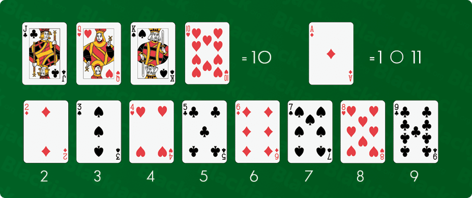
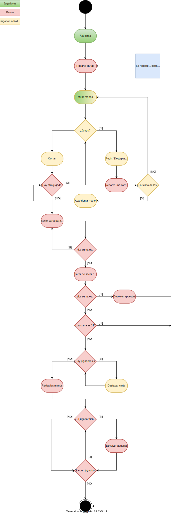

# *Reglas del juego*

## Objetivo

#### *Conseguir mayor puntuación que la banca sin pasar de 21.*

## Rarezas: 

 - Si la puntuación es igual, gana la banca.

 - La banca debe sacar carta si su puntuación es menor o igual a 16.

 - Se considera Blackjack la suma de `J`, `Q` o `K` + `AS`

## Apuestas:

 - Si el jugador supera a la banca en puntuación obtiene una ganancia de 1:1

 - Si el jugador gana a la banca con blackjack obtiene una ganancia de 2:1

# *Valores de las cartas*

# *Diagrama de juego*

# Programa:

El programa emula una partida de blackjack real, con las mismas reglas, funcionamiento y haciendo que cada jugador vea exactamente lo que vería si estuviera jugando en una mesa de blackjack real. Para conseguir eso hemos hecho uso de variables, bucles, estructuras de control de flujo y diferentes funciones que crean y modifican la información del juego. Esta información del juego son los datos de todos los jugadores i de la banca los cuales son almacenados en listas. Estas listas se ordenan de la siguiente manera:

**Listajugadores**: Esta lista es donde se guarda toda la información de cada jugador. Cada elemento de la lista es otra lista con toda la información de un jugador. De esta forma conseguimos guardar todos los datos de cada jugador de manera ordenada i sabiendo a quien pertenece cada uno. Esta lista seria algo así:

`Listajugadores=[ ["jugador","sudinero","apuesta",["cartasenMano"],"valormano"] , ["jugador","sudinero","apuesta",["cartasenMano"],"valormano"] , ["jugador","sudinero","apuesta",["cartasenMano"],"valormano"] ]`

Esta lista representaría a 3 jugadores con sus respectivos datos. Como vemos el 4 elemento de la lista de cada jugador es otra lista en la cual se almacenarán todas las cartas que se le vayan dando durante la ronda. Las listas, como las vemos aquí, solo estarán así durante el momento que dure la ronda, al terminar la ronda los datos de apuesta, cartas en mano y valor mano se borran ya que son diferentes en cada una de las rondas.

**Listabanca**: Esta lista es donde se guarda toda la información de la banca. En esta lista como máximo solo habrá 3 elementos ya que no guardamos nombre para la banca ni tampoco apuesta, ya que la banca no apuesta. Esta lista seria algo así:

`listabanca=["Dinero",["cartas"],"valorcartas"]`

Como ocurre en la lista anterior las cartas en mano son otra lista dentro de la lista. Al igual que la anterior lista, esta solo estará así durante la ronda, al terminar se borraran los datos de cartas y valor cartas ya que son diferentes en cada ronda.
