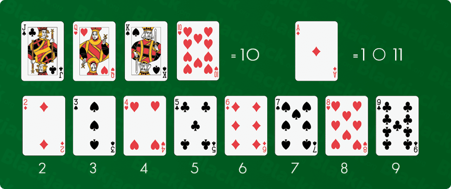

# *Reglas del juego*

## Objetivo

#### *Conseguir mayor puntuación que la banca sin pasar de 21.*

## Rarezas: 

 Si la puntuación es igual, gana la banca.

 La banca debe sacar carta si su puntuación es menor o igual a 16.

 Se considera Blackjack la suma de J, Q o K + AS

## Apuestas:

 Si el jugador supera a la banca en puntuación obtiene una ganancia de 2:1

 Si el jugador supera a la banca con 21 puntos obtiene una ganancia de 3:2

 Si el jugador gana a la banca con blackjack obtiene una ganancia de 3:1

# *Valores de las cartas*

